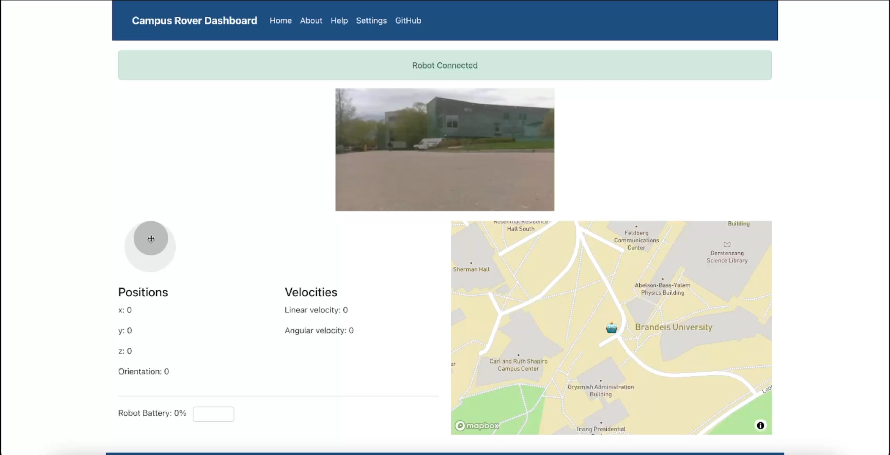

# **Project Command & Control**
*Empowering remote control of campus robots*

**Team Members:**
- Brandon J. Lacy (blacy@brandeis.edu)
- Naimul Hasan (naimulhasan@brandeis.edu)
- James Kong (jameskong@brandeis.edu)

## **General Overview**
The Campus Rover Command & Control project is a critical component of the Campus Rover Project at Brandeis University, facilitating remote control between the operator and the robot. The system consists of three main components:
- **Web Application:** Built using React, serves as the user interface for controlling the robot. Supports teleoperation and camera feed, along with Progressive Web App (PWA).
- **ROS (Robot Operating System):** Manages the robot's operations.
- **rosbridge:** Enables communication between the web application and ROS.

### **Key Features:**
- Live camera feed
- Teleoperation controls
- GPS mapping and robot metrics

## **Goals**
### **Demo Goals:**
- Showcase a professional application for future students.
- Demonstrate working teleop control, live camera feed, GPS mapping, and robot metrics.

### **Learning Objectives:**
- Understand ROS core communication.
- Gain real-world project experience.

### **Evaluation Criteria:**
- Focus on convenience and understandability for users.

## **Documentation**
Additional documentation can be found in the following files:
- [Command Control Report](report/command-control-report.md)

## **Contributing**
For guidelines on how to contribute to this project, please refer to the [CONTRIBUTING.md](CONTRIBUTING.md) file.

## **Deployment**
Detailed instructions on how to deploy the application can be found in the [DEPLOYMENT.md](DEPLOYMENT.md) file.

## **Screenshots**
Here are some screenshots of the application in action:

**The dashboard shows the live camera feed, teleoperation controls, GPS mapping, and robot metrics (Linear and Angular velocities, Battery Status).**

## **Presentation Videos**
Check out our presentation videos:
- [Video](screenshots/Command%20Control%20Demo%20Video.mp4)

